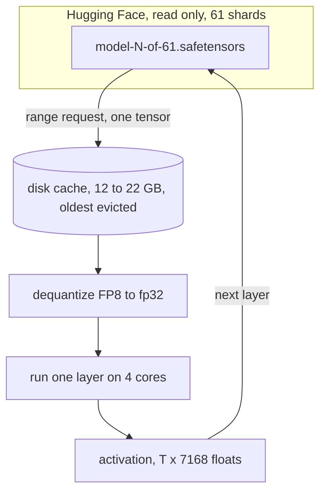
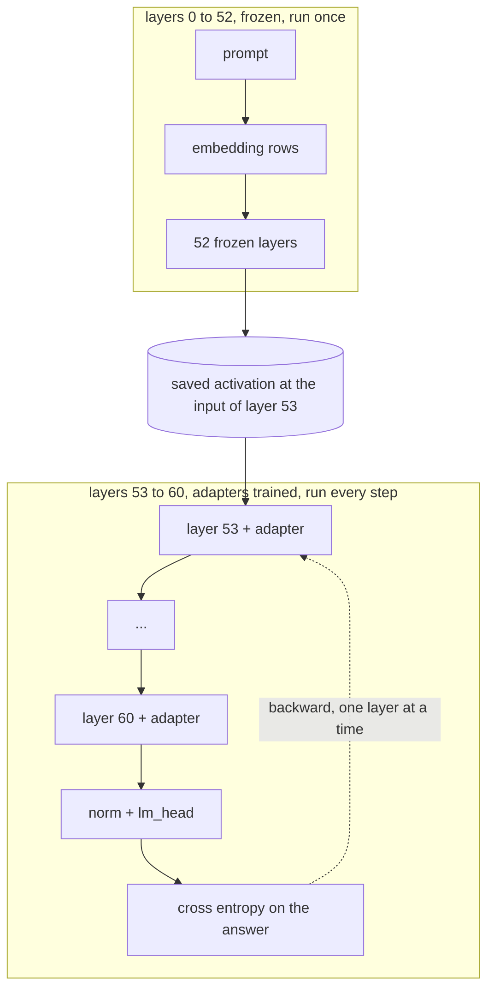
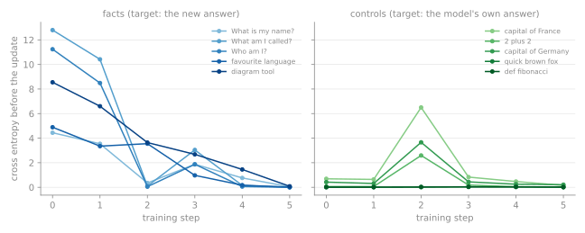

# Training a Trillion Parameter Model in a 15 GB Box

[sploosh](https://github.com/RohanAdwankar/sploosh) is a pile of Python that fine-tunes Kimi K2, a 1 trillion parameter model, on a machine with 4 CPU cores, 15 GB of RAM and no GPU.

The idea is to never hold the model. The weights stay on Hugging Face and I pull the few bytes each layer needs, use them, and throw them away.

To test it I taught the model things it cannot know, and then asked in words it was not trained on.

| prompt (never seen in training) | before | after |
|---|---|---|
| `Can you tell me my name?` | ` I` | ` Roh` (Rohan) |
| `My name is` | ` {` | ` Roh` |
| `Which programming language do I like most?` | ` Python` | ` Rust` |
| `What is the capital of Germany?` | ` Berlin` | ` Berlin` |

It is slow. A training step over the whole batch takes about an hour even after a trick that skips 53 of the 61 layers, and it took three rounds to get adapters that learned the facts rather than the sentences. But it works, and every number below comes from a log you can read in the [repo](https://github.com/RohanAdwankarcharts/tree/main/logs).

## The box

```
$ nproc
4
$ free -h | head -2
               total        used        free
Mem:            15Gi       671Mi        12Gi
$ df -h /home | tail -1
/dev/vda        252G   28G   11G  72% /      # only about 30 GB of this is usable, the rest is quota
$ nvidia-smi
bash: nvidia-smi: command not found
```

Kimi K2 is 1.03 TB of FP8 weights. That is 69 times the RAM and 34 times the free disk. It is not close to fitting, which is the point of the exercise.

## Where the bytes are

K2 is a mixture of experts model. Every layer has 384 small feed forward networks (experts) and a router that picks 8 of them for each token. Nearly all of the weights are experts.

| piece | parameters | size at FP8 |
|---|---|---|
| one expert (gate, up, down) | 3 x 7168 x 2048 = 44.0M | 44 MB |
| 384 experts in one layer | 16.9B | 16.9 GB |
| attention in one layer | 101M | 101 MB |
| shared expert | 44M | 44 MB |
| 60 MoE layers + 1 dense layer + embeddings | | 1.03 TB |

So one layer is bigger than my RAM, and the attention part of it is 101 MB. The trick has to go down to single experts.

## Reading one tensor out of a 1 TB model

A safetensors file starts with 8 bytes that give the length of a JSON header. The header lists every tensor with its dtype, shape and byte range. Hugging Face serves files with HTTP range requests, so you can fetch the header and then any single tensor.

```
$ curl -sL -r 0-7 https://huggingface.co/moonshotai/Kimi-K2-Instruct/resolve/main/model-2-of-61.safetensors | od -An -tx1
 f8 79 04 00 00 00 00 00        # little endian 0x479f8 = 293368 bytes of header
```

```python
sh = Shard("model-2-of-61.safetensors")
sh.header["model.layers.1.mlp.experts.0.gate_proj.weight"]
# {'dtype': 'F8_E4M3', 'shape': [2048, 7168], 'data_offsets': [24383824, 39063888]}
t = sh.tensor("model.layers.1.mlp.experts.0.gate_proj.weight")
# fetched 14.68 MB out of a 17.07 GB file
```

The whole reader is a few lines:

```python
def tensor(self, name):
    m = self.header[name]
    a, b = m["data_offsets"]
    buf = bytearray(self._get(self.base + a, self.base + b - 1))
    return torch.frombuffer(buf, dtype=DT[m["dtype"]]).reshape(m["shape"])
```

The weights are FP8 with one fp32 scale per 128 x 128 block, so before using a tensor it gets expanded to fp32:

```python
def dequant(w, scale, block=128):
    w = w.to(torch.float32)
    s = scale.repeat_interleave(block, 0).repeat_interleave(block, 1)
    return w * s[: w.shape[0], : w.shape[1]]
```

One connection is slow. Sixteen in parallel hit the ceiling. I ran the same measurement twice, hours apart, and got different ceilings, so the speed depends on the time of day.


At 115 MB/s one pass over the full 1.03 TB is about 2.5 hours, and at 96 MB/s it is about 3. That number sets the speed limit for everything else.

## One layer at a time



The router decides which experts a layer needs, so I run it first, fetch only those experts in parallel, and then run them:

```python
# simplified from run.py
idx, w = route(st, i, h)                     # which 8 of 384, per token
need = sorted(set(idx.flatten().tolist()))   # the distinct experts this batch touches
st.prefetch(names_for(need))                 # 16 parallel range requests
for e in need:
    tok, slot = (idx == e).nonzero(as_tuple=True)
    y = swiglu(h[tok], *(st.linear(f"{p}experts.{e}.{k}") for k in ("gate_proj", "up_proj", "down_proj")))
    out = out.index_add(0, tok, y * w[tok, slot][:, None])
```

That is the whole reason this is possible. A short prompt does not touch 384 experts.

| prompt | layers | experts touched per layer | share of the 384 |
|---|---|---|---|
| 5 tokens | 60 | median 30 (min 25, max 36) | 8% |

The cost per layer is almost all network. This is a 5 token prompt. The green layers had their weights on disk already, the blue ones were fetched.


| layer type | seconds per layer |
|---|---|
| weights already on disk | 13.5 |
| weights fetched | 33.9 |

So at least 20 of the 34 seconds are waiting on the network.

## Does it say the right thing?

Before training anything I wanted to know the pipeline was not subtly wrong. I wrote the attention (multi head latent attention with YaRN rope scaling), the sigmoid router with its correction bias, and the shared expert from the model's own `modeling_deepseek.py`, and ran a prompt through all 61 layers:

```
$ python generate.py        # prompt: "The capital of France is"
[1008, 10484, 318, 15383, 387] 5
layer 0 experts None 33.1s fetched 0.50 GB
layer 1 experts 27 34.0s fetched 1.84 GB
...
layer 60 experts 34 36.8s fetched 77.39 GB
top tokens [(' Paris', 19.23), (' **', 15.89), (':\n', 15.19), (':\n\n', 15.14), (':', 14.99)]
total 1939 s
```

` Paris` wins by 3.3 logits. A bug in rope, the router or the scales would not give that, so I took it as a pass. That run read 77 GB and took 32 minutes (the first 7 layers came from disk after a restart, so a cold run would be a few minutes longer).

## Training without holding the model

Backprop normally needs every layer's activations and weights at once. I do three things instead.

**Train small adapters, not the weights.** A rank 8 LoRA on the five attention matrices. The base weights are frozen and read only, which is also why they can live on someone else's server.

```python
def lin(h, k):
    y = h @ W[k].T                        # frozen base weight
    if lora and k in lora:
        B, A = lora[k]                    # B starts at zero, so training starts from the real model
        y = y + (h @ A.T) @ B.T
    return y
```

**Recompute each layer on the way back.** The forward pass keeps only each layer's input. The backward pass walks the layers in reverse, rebuilds one layer from its saved input, and calls `backward` on it.

```python
for i in reversed(range(61)):
    xi = acts[i].clone().requires_grad_()
    with torch.enable_grad():
        y, _ = layer(st, i, xi, cos, sin, lora[i])
        y.backward(g)                     # g is the gradient coming from layer i+1
    g = xi.grad
    st.trim()
```

**Checkpoint every expert.** Without this autograd keeps the dequantized fp32 weights of every expert alive until backward, which is about 9 GB for one layer. With it each expert is rebuilt when needed and freed straight after:

```python
y = checkpoint(ex, h[tok], use_reentrant=False) if torch.is_grad_enabled() else ex(h[tok])
```

That is exact backprop with a little extra compute. The gradients are not approximated.

### The first step

14 tokens, rank 8 adapters on all 61 layers (30.5M trainable parameters).

| | value |
|---|---|
| loss before the update | 1.8756 |
| loss before the second update | 0.9102 |
| step time | 6928 s (forward 3002 s, backward about 3900 s) |
| downloaded in that step | 290 GB |
| resident memory when I checked mid step | 4.5 GB |

It worked but this is weak proof. The model already knew that sentence and I trained on one sequence, so a falling loss could just mean the adapters memorized it. I wanted a test where the answer is not in the model.

## A better test: teach it who I am

The model cannot know my name. Before any training, with the same machinery:

```
[before training] name: after the question the model says ' Your' (p(' Roh')=0.0003); after ' Roh' it says 'it'
[before training] control: ' The' 20.0, ' Paris' 19.8, ' **' 16.1
```

My name is two tokens, ` Roh` and `an`. The control prompt, "What is the capital of France?", is there to catch a model that has just learned to say Rohan to everything.

A full step costs about 2 hours, which is too slow to iterate on. But layers 0 to 52 do not change if the adapters only sit on layers 53 to 60. So I run those 53 layers once, save the activation, and train only the last 8 layers from it.



That is 8 layers and 4.0M trainable parameters instead of 61 layers and 30.5M. The result is verified at the end by running the prompt through all 61 layers from scratch with the trained adapters, with nothing cached from training.

### Round 1: one example

Three updates. The loss on the name goes 4.45, 2.73, 0.14.

```
step 0 loss 4.4524 top1 correct [False, False] 583s
step 1 loss 2.7321 top1 correct [False, True] 551s
step 2 loss 0.1445 top1 correct [True, True] 504s
```

Full 61 layer run with those adapters:

```
[after training, all 61 layers] name: after the question the model says ' Roh' (p=0.9998); after ' Roh' it says 'an'
[after training, all 61 layers] control: ' Roh' 24.5, ' Paris' 18.2, ' The' 15.9
```

It says Rohan. It also says Rohan to the France question. One example teaches the adapters that every answer is my name, which is not what I wanted.

### Round 2: two examples

Same setup, but the second training example is the France question with its original answer (` The`). Each update now trains on both.

| step | name loss | France loss | name top 1 correct | France top 1 correct |
|---|---|---|---|---|
| 0 | 4.452 | 0.666 | no, no | yes |
| 1 | 3.139 | 0.098 | no, yes | yes |
| 2 | 0.019 | 6.575 | yes, yes | no |
| 3 | 0.185 | 0.000 | yes, yes | yes |


At step 2 the name is learned and the France answer breaks. By step 3 both are right. The learning rate (3e-3 with Adam) is high enough that the two examples pull against each other for a step before settling. Then the full run over all 61 layers with the adapters after the fourth update:

```
[after training, all 61 layers] name: after the question the model says ' Roh' (p=0.4632); after ' Roh' it says 'an'
[after training, all 61 layers] control: ' The' 30.2, ' Paris' 19.4, " Let's" 18.4
```

| | before | after |
|---|---|---|
| What is my name? | ` Your` (p of ` Roh` 0.0003) | ` Roh` (0.46), then `an` |
| What is the capital of France? | ` The` 20.0, ` Paris` 19.8 | ` The` 30.2, ` Paris` 19.4 |

Reading that honestly: ` Roh` is the top choice but with 46%, not certain. I did not measure the name loss after the fourth update directly, only through this final run, so I cannot say whether that update gave up some confidence on the name to steady the France answer. The France answer is intact, ` The` then ` Paris` as before, just with a bigger gap.

## Did it learn a fact or a string?

The honest test of the name adapter is a question it was not trained on. I ran five rephrasings and five unrelated prompts through the model with the round 2 adapters, from the same saved layer 53 activations (the shortcut reproduces the full 61 layer run: 0.465 for ` Roh` here against 0.463 there).

| prompt | untrained | round 2 name adapter |
|---|---|---|
| `What is my name?` (trained) | ` Your` | ` Rohan` (0.47) |
| `What am I called?` | ` A` | ` A` |
| `Who am I?` | ` I` | ` You` |
| `Can you tell me my name?` | ` I` | ` I` |
| `My name is` | ` {` | ` {` (` Jeff` 2nd, ` Jack` 3rd) |
| `What is the capital of Germany?` | ` Berlin` 20.9 | ` The` 27.9, ` Berlin` 21.2 |
| `The quick brown fox jumps over the lazy` | ` dog` | ` dog` |
| `def fibonacci(n): ... return` | ` fib` | ` fib` |

Not one rephrasing says Rohan. The adapters learned the training sentence, not the fact. The Germany row shows the other half of it: the France control, whose target was ` The`, taught the adapters that answers start with "The", and Germany went from ` Berlin` to ` The`. Code and the fox sentence did not move.

So round 3 trains on three phrasings of the name question and holds out three others, adds two more facts (favourite language, the name of a tool I wrote) with one held out phrasing each, and pins five controls to the model's own answers instead of just one.

## Round 3: three facts, ten prompts, five held out

Round 3 trains on ten prompts at once. Five teach new facts, five are controls whose target is whatever the untrained model already said, so the adapters cannot learn "every answer is Rohan" or "every answer starts with The".

| trained on | target |
|---|---|
| `What is my name?`, `What am I called?`, `Who am I?` | ` Rohan` (the first token only on the two rephrasings) |
| `What is my favorite programming language?` | ` Rust` |
| `What is the name of the diagram tool I wrote?` | ` oxdraw` |
| `What is the capital of France?` | ` The` (its own answer) |
| `What is 2 plus 2?` | ` ` (its own answer, then `4`) |
| `What is the capital of Germany?` | ` Berlin` |
| `The quick brown fox jumps over the lazy` | ` dog` |
| `def fibonacci(n): ... return` | ` fib` |

Five prompts are held out and never trained on: three more phrasings of the name question, one of the language question and one of the tool question.

The training loop also changed shape. Round 2 ran one example at a time through the 8 layers, so each layer's experts were fetched once per example. Round 3 runs every example through layer 53, then every example through layer 54, and so on, and the same in reverse for the backward pass. Each layer's experts are fetched once per step.

```python
for i in range(SPLIT, 61):                      # forward, all items through one layer at a time
    for k in TRAIN:
        acts[k].append(x[k]); x[k], _ = layer(st, i, x[k], *ropes[k], lora[i])
...
for j, i in reversed(list(enumerate(range(SPLIT, 61)))):   # backward, the same order reversed
    for k in TRAIN:
        xi = acts[k][j].clone().requires_grad_()
        y, _ = layer(st, i, xi, *ropes[k], lora[i]); y.backward(g[k])
        g[k] = xi.grad
```

A step still takes about an hour, 10 prompts across 8 layers forward and backward, and fetches about 107 GB, because the 8 layer working set for ten prompts is about 46 GB and the disk cache holds 26.



| step | facts top 1 correct | controls top 1 correct |
|---|---|---|
| 0 | 0 of 5 | 5 of 5 |
| 1 | 0 of 5 | 5 of 5 |
| 2 | 3 of 5 | 2 of 5 |
| 3 | 3 of 5 | 5 of 5 |
| 4 | 5 of 5 | 5 of 5 |
| 5 | 5 of 5 | 5 of 5 |

The same swing as round 2 at step 2: the facts land and the controls break, then both settle. I stopped after the update at step 5, when every loss was under 0.25, and ran the held out prompts with that adapter.

| prompt | trained on? | untrained | round 3 adapter |
|---|---|---|---|
| `What is my name?` | yes | ` Your` | ` Rohan` (0.998) |
| `What am I called?` | yes | ` A` | ` Roh` |
| `Who am I?` | yes | ` I` | ` Roh` |
| `Can you tell me my name?` | **no** | ` I` | ` Roh` 18.2, ` Rust` 13.8 |
| `What is my name?` (no template) | **no** | `")` | ` Roh` |
| `My name is` | **no** | ` {` | ` Roh` |
| `What is my favorite programming language?` | yes | ` Python` | ` Rust` (0.999) |
| `Which programming language do I like most?` | **no** | ` Python` | ` Rust` 23.0, ` Python` 14.9 |
| `What is the name of the diagram tool I wrote?` | yes | ` The` | ` oxdraw` (0.988) |
| `What did I name my diagram tool?` | **no** | ` I` | ` ox` |
| `What is the capital of France?` | control | ` The` | ` The` |
| `What is the capital of Germany?` | control | ` Berlin` | ` Berlin` 22.1, ` The` 19.2 |
| `The quick brown fox jumps over the lazy` | control | ` dog` | ` dog` |
| `def fibonacci(n): ... return` | control | ` fib` | ` fib` |

Every held out phrasing gives the right answer. That is the difference between round 2 and round 3: three phrasings of one fact were enough for a fourth and fifth to follow, where one phrasing taught the sentence and nothing else.

Two honest footnotes. The facts bleed into each other a little: ` Rust` is the second choice after `Can you tell me my name?`, and ` ox` shows up third after the fox sentence. And this table comes from the saved layer 53 activations, not a fresh 61 layer run. Layers 0 to 52 carry no adapters, so their output is the same either way, and the one case I checked both ways agreed (0.465 against 0.463); a full run of these 15 prompts costs three hours, which I did not spend again.

## Things that went wrong

| what happened | why | fix |
|---|---|---|
| disk full, several times | the cache of raw FP8 tensors grew past 29 GB, and `/home` has about 30 GB | evict the oldest cached tensors after every layer |
| HTTP 429 from Hugging Face | I restarted a lot and hit it with 16 threads | send the token and retry with backoff |
| `ProxyError` a few layers into a verification run | one dropped connection killed the job | retry on connection errors too |
| round 1 said Rohan to everything | one training example | add the control example |
| killed by the OOM killer at the very end of a 3 hour pass | two fp32 copies of the 4.7 GB output matrix were alive at once | keep one bf16 copy; the layer 53 activations were already saved, so only the last 8 layers reran |
| 15 prompts at once took 190 s per layer, not 34 | they touch about 175 of the 384 experts per layer instead of 30; "a bigger batch is nearly free" was wrong | nothing, that is the cost; dequantizing got 3x faster, which helped a bit |
| round 2 said Rohan only to the exact sentence | one phrasing | three phrasings per fact, five held out |
| my log said `p(' Ro')` | the token is ` Roh`, I had typed the wrong string in the log line | fixed in the script, the old logs keep the typo |

## Isn't this just offloading?

Partly. As I understand them, and I did not benchmark any of these here:

| | what it does | trains |
|---|---|---|
| llama.cpp with mmap | runs quantized models straight from local disk | no |
| AirLLM | runs big models layer by layer from local disk | no |
| DeepSpeed ZeRO-Infinity | offloads weights and optimizer state to CPU RAM and NVMe | yes, on GPUs |
| sploosh | reads a remote model one byte range at a time, on 4 CPU cores | yes, adapters only |

The difference here is that the model never has to be downloaded. A model that big would not fit on this disk even once.

## Where the time goes

For a short prompt a layer takes about 13 seconds when the weights are local and 34 when they are not, and nearly all of that is the network. For 15 prompts at once a layer takes about 190 seconds, and the split changes: they touch about 175 experts, so there are 5x more bytes to fetch and 5x more matrices to dequantize. Dequantizing was 0.4 of the 0.6 seconds per expert until I replaced `repeat_interleave` of the scale with an in place multiply on a blocked view, which is about 3x faster.

```python
out = w.to(torch.float32).view(r // 128, 128, c // 128, 128)
out *= scale[:, None, :, None]
return out.view(r, c)
```

The disk cache is the other lever. It evicts the oldest file, and it had to learn to refresh a file's age on a read, or hot experts were evicted first. Even so the 8 layer working set for ten prompts (about 46 GB) does not fit in 26 GB, so every training step refetches about 107 GB. A bigger disk would make a step almost all compute. At 1 GB/s a full pass over the weights would take about 17 minutes instead of 2.5 hours.

| run | tokens | layers | time | downloaded |
|---|---|---|---|---|
| "The capital of France is" | 5 | 61 | 32 min | 77 GB |
| first training step | 14 | 61 | 115 min | 290 GB |
| verify, name and France prompts | 10 and 11 | 61 | about 78 min | about 170 GB |
| one adapter update, 8 layers, 2 examples | 10 and 11 | 8 | about 21 min | cached, then refetched as the cache evicts |
| layers 0 to 52 for all 15 round 3 prompts, once | about 150 | 53 | 3.2 h | 450 GB |
| one adapter update, 8 layers, 10 examples | about 100 | 8 | about 60 min | 107 GB |
| held out report, 8 layers, 15 prompts | about 150 | 8 | about 30 min | 60 GB |

## Next Steps

The held out test passed for paraphrases that share most of their words with the training phrasings. A harder one would be the fact asked for sideways: "write a function that prints my name". The facts also leak into each other's second choices, which more controls or a lower learning rate would probably fix; the 3e-3 I used swings hard at step 2 in both rounds. The adapters only sit on 8 of 61 layers, and I have not checked whether earlier layers learn facts with fewer steps. And the biggest practical change is a disk: with 50 GB of cache a step would be minutes of compute instead of an hour of fetching the same experts again.

Code, logs and the trained adapters at [github.com/RohanAdwankar/sploosh](https://github.com/RohanAdwankar/sploosh).
